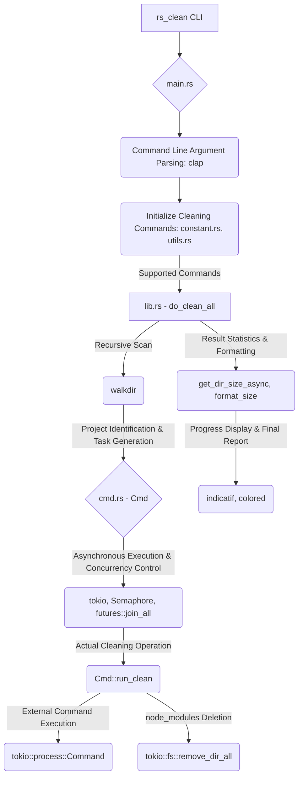

# 🧹 rs_clean – Clean Build Targets for Rust, Go, Gradle, and Maven

> ⚡ Easily remove compiled build artifacts from Rust, Go, Gradle, and Maven projects with a single command.

📘 Looking for Chinese docs? [View 中文说明 🇨🇳](./README_zh.md)


---

## 🏗️ Architecture Overview



## 🚀 Quick Start

```bash
$ rs_clean folder/
```

**🎯 Interactive Experience!**
When you run `rs_clean`, it now shows you exactly what will be deleted and asks for confirmation:

```bash
$ rs_clean my_projects/

Scanning for projects to clean...

=== Deletion Preview ===
Found projects to clean:
  1. my_projects/rust_app (cargo) - 156.2 MB
  2. my_projects/go_service (go) - 45.8 MB
  3. my_projects/gradle_app (gradle) - 89.1 MB

Total space to be freed: 291.1 MB

Select cleaning mode:
> Clean all projects
  Select specific projects to clean
  Review each project individually
  Cancel operation
```

### 🎮 Navigation Guide
- **Arrow Keys**: Navigate through options
- **Enter**: Confirm selection
- **Space**: Select/deselect items (in multi-select mode)
- **ESC**: Cancel operation

### 📋 Command Line Options

```bash
# Basic usage with interactive confirmation
$ rs_clean folder/

# Skip confirmation prompts (for automation)
$ rs_clean folder/ --no-confirm

# Preview what would be deleted without actually deleting
$ rs_clean folder/ --dry-run

# Exclude specific directories
$ rs_clean folder/ --exclude-dir node_modules --exclude-dir build

# Show detailed output
$ rs_clean folder/ --verbose
```

---

## 📦 Installation

### Option 1: Install via Cargo

```bash
cargo install rs_clean
```

### Option 2: Download from Releases

👉 [Download from GitHub Releases](https://github.com/pwh-pwh/rs_clean/releases)
Grab the latest binary for your operating system.

---

## ✨ Features

* ✅ Cleans **Rust** projects: `target/`
* ✅ Cleans **Go** build output
* ✅ Cleans **Gradle** projects: `build/`
* ✅ Cleans **Maven** projects: `target/`
* ✅ Cleans **Node.js** projects: `node_modules/` (by removing `node_modules` directory directly)
* ✅ Cleans **Python** projects: `__pycache__/`, `venv/`, `.venv/`, `build/`, `dist/`, `.eggs/`, etc. (by removing these directories directly)
* ✅ Recursively scans subdirectories
* ✅ Automatically detects project type
* ✅ **Efficient Parallel Processing:** Utilizes asynchronous operations and CPU core awareness for fast, concurrent cleaning.
* ✅ **Safety Mechanisms:** Includes limits on directory depth and file count to prevent excessive resource consumption.
* ✅ **Disk Space Reporting:** Shows the total disk space freed after cleanup.

---

## 📂 Example Structure

```bash
$ tree my_projects/
my_projects/
├── rust_app/
│   └── target/
├── go_service/
│   └── bin/
├── gradle_app/
│   └── build/
└── maven_module/
    └── target/
```

After running:

```bash
$ rs_clean my_projects/
```

The build artifacts will be cleaned:

```bash
$ tree my_projects/
my_projects/
├── rust_app/
├── go_service/
├── gradle_app/
└── maven_module/
```

---

## 💡 Use Cases

* Free up disk space by removing large build folders.
* Ensure a clean build environment in CI/CD pipelines.
* Clean multiple types of projects in monorepos.

---

## 🛠 Roadmap

* [ ] Add interactive confirmation prompts
* [ ] More detailed disk space reporting per project
* [ ] Customizable exclusion lists for specific directories/files (partially implemented with `--exclude-dir`)

---

## 🤝 Contributing

We welcome contributions and feedback!

* Open an [issue](https://github.com/pwh-pwh/rs_clean/issues) for bugs or suggestions
* Submit a pull request for enhancements
* Star ⭐ the repo if you find it helpful

---

## 📄 License

MIT License © 2025 \[coderpwh]
