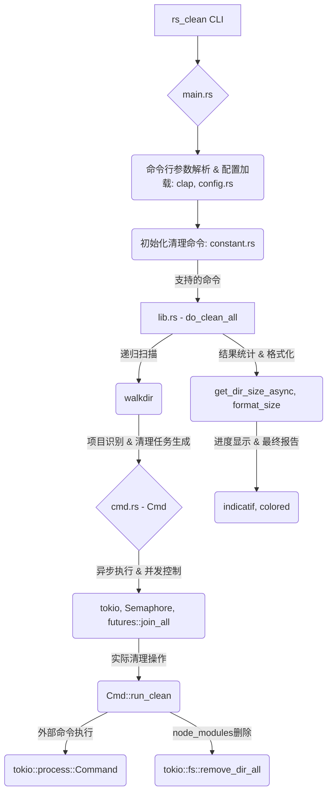

# 🧹 `rs_clean` – Clean Rust/Go/Gradle/Maven Project Targets

> ⚡ 清理 Rust、Go、Gradle、Maven 等项目的构建产物，仅需指定项目根目录。

---

## 🏗️ 架构概览



## 🚀 快速开始

```bash
$ rs_clean folder/
```

**🎯 全新交互式体验！**
现在运行 `rs_clean` 时，会先显示将要删除的内容，并要求您确认：

```bash
$ rs_clean my_projects/

Scanning for projects to clean...

=== Deletion Preview ===
Found projects to clean:
  1. my_projects/rust_app (cargo) - 156.2 MB
  2. my_projects/go_service (go) - 45.8 MB
  3. my_projects/gradle_app (gradle) - 89.1 MB

Total space to be freed: 291.1 MB

Select cleaning mode:
> Clean all projects
  Select specific projects to clean
  Review each project individually
  Cancel operation
```

### 🎮 操作指南
- **方向键**：在选项间导航
- **回车键**：确认选择
- **空格键**：选择/取消选择项目（多选模式）
- **ESC**：取消操作

### 📋 命令行选项

```bash
# 基本用法（带交互确认）
$ rs_clean folder/

# 跳过确认提示（适用于自动化脚本）
$ rs_clean folder/ --no-confirm

# 预览将要删除的内容但不实际删除
$ rs_clean folder/ --dry-run

# 排除特定目录
$ rs_clean folder/ --exclude-dir node_modules --exclude-dir build

# 显示详细输出
$ rs_clean folder/ --verbose
```

---

## 📦 安装方式

### 方式 1：使用 Cargo 安装（推荐）

```bash
cargo install rs_clean
```

### 方式 2：从 Release 页面下载可执行文件

👉 [前往 Releases 页面](https://github.com/pwh-pwh/rs_clean/releases) 下载安装适合你系统的版本（如 macOS/Linux/Windows）。

---

## ✨ 功能特性

* ✅ 支持 **Rust** 项目 (`target/`)
* ✅ 支持 **Go** 项目 (`go build` 输出缓存)
* ✅ 支持 **Gradle** 项目 (`build/`)
* ✅ 支持 **Maven** 项目 (`target/`)
* ✅ 支持 **Node.js** 项目 (`node_modules/`，直接删除 `node_modules` 目录)
* ✅ 支持 **Python** 项目 (`__pycache__/`、`venv/`、`.venv/`、`build/`、`dist/`、`.eggs/` 等，直接删除这些目录)
* ✅ **递归扫描子目录**
* ✅ **自动识别项目类型并清理**
* ✅ **高效并行处理:** 利用异步操作和 CPU 核心感知能力，实现快速并发清理。
* ✅ **可配置的安全机制:** 目录深度和文件数量限制现在可通过命令行参数或配置文件进行配置。
* ✅ **磁盘空间报告:** 清理后显示释放的总磁盘空间。

---

## 📂 示例

```bash
$ tree my_project/
my_project/
├── rust_project/
│   └── target/
├── go_project/
│   └── bin/
├── gradle_project/
│   └── build/
└── maven_project/
    └── target/
```

```bash
$ rs_clean my_project/
```

清理完成后：

```bash
$ tree my_project/
my_project/
├── rust_project/
├── go_project/
├── gradle_project/
└── maven_project/
```

---

## 💡 使用场景

* 项目根目录空间紧张，需要快速释放磁盘。
* CI/CD 脚本中快速清理构建缓存。
* 清理多语言项目的中间文件。

---

## 🛠️ 开发计划

* [ ] 增加交互确认模式
* [ ] 更详细的按项目磁盘空间报告

---

## 🤝 欢迎贡献

欢迎提 Issue、PR 和 Star！🧡
一起让 `rs_clean` 更加好用！
